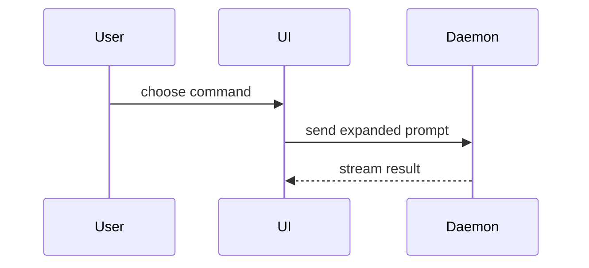

写 PR 正文时用这个模板：

```markdown
## Summary

<图示、diff 草图或树状图>

## Evidence

- **Before:** <截图/输出/失败的测试运行>
  **After:** <截图/输出/通过的测试运行>

## Merge Danger

**Door:** <单向门还是双向门>

<可选：说明>

**Blast Radius:** <一个词的描述>

<可选：这次合并可能带来的连锁影响>
```

## 各小节

跳过所有开场白，正文保持简短。用 `CONTEXT.md` 里用户的领域语言。

### 摘要

挑最小的视图，只要能把关键点说清即可。

- 用伪代码展示逻辑或算法：

```text
on(save)
  if content is unchanged
    return cached result
  write new content
  return fresh result
```

- 用调用树展示运行时的控制流：

```text
submitForm
  createSession
    persistPrompt
    launchAgent
  navigateToSession
```

- 用组件树展示 UI 结构，把要紧的状态和模块边界也带上：

```tsx
<SessionPage>(apps / example / src / routes / session.tsx);
useSessionEvents() < SessionToolbar > <RunSkillButton>(packages / ui);
```

- 用浅文件树展示文件职责或一次大范围重构：

```text
src/
├── commands/       # parses user actions
├── sessions/       # owns session state
└── transport/      # sends API requests
```

- 用 Mermaid 展示组件交互、控制流或数据流：



- 当重点是「变了什么」、而周围的形态已经存在时，用 `diff`。让 diff 的形态贴合主题。

组件改动：

```diff
 <SessionPage>
   useSessionEvents()
   <SessionToolbar>
+    <RunSkillButton />
   <SessionTimeline>
+    <SkillResultCard />
```

文件布局改动：

```diff
 src/
 ├── commands/
+│   └── show-me.ts       # expands the slash command
 ├── sessions/
-└── transport.ts
+└── transport/
+    ├── client.ts
+    └── stream.ts
```

调用树或调用栈改动：

```diff
 submitForm
   createSession
     persistPrompt
+    expandSkillMention
     launchAgent
-  navigateToSession
+  navigateToSession
+    subscribeToEvents
```

状态或控制流改动：

```diff
 on(save)
-  write content
+  if content is unchanged
+    return cached result
+  write new content
+  invalidate cache
```

- 当大部分内容都是新的、省略的上下文会掩盖归属或顺序、或者用户需要一个可以照抄的目标形态时，展示整块：

```ts
function expandSkill(command: string): string {
  const skillName = command.slice(1);
  return `use the ${skillName} skill`;
}
```

#### 指引

把每个图示放在它所支撑的简短文字旁边。只保留回答用户当前问题、或给出当前讨论点的解决选项所需的那几个调用、文件、props、状态和边界。

你可以用其中一种，也可以用上几种，但不太可能全都用上。自己判断，不要淹没用户。

### 证据

用具体证据证明改动有效。展示改动前后。

截图是 S-tier：前提是环境已为此搭好，而且改动是视觉上的。

基于执行的证据是 A-tier：测试结果、控制台输出。用伪代码展示那个先失败、后通过的具体测试。

### 合并风险

说明这是单向门（one-way door）还是双向门（two-way door）。双向门可以退回去，单向门不能。回滚代价低的 PR 风险更低。凡是涉及破坏性动作或难以回退的决策的改动，都是单向门。

影响半径（blast radius）指这个 PR 引入的改动可能带来的影响或波及范围。要把所有可能性都考虑进来。例如布局抖动、对使用方的破坏、移动端适配等。
